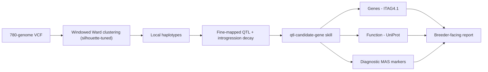

<p align="center">
  
</p>

# haploqtl

[](https://github.com/tayloranthonyanderson/haploqtl/actions/workflows/ci.yml)
[](LICENSE)
[](https://www.python.org/)

**Reproducible, AI-augmented local-ancestry inference for fine-mapping QTL and predicting trait donors from large genomic sequence libraries.**

`haploqtl` turns a library of whole-genome sequences into actionable breeding intelligence. It detects cryptic ancestral introgressions, narrows the genomic intervals of quantitative trait loci (QTL), traces those loci to their historical donor cultivars, and predicts the trait in untested gene-bank accessions — without the need for purpose-built mapping populations.

> **Provenance.** This project modernizes and extends the method published in
> Anderson *et al.* (2024), *The Plant Journal* — [doi:10.1111/tpj.16495](https://doi.org/10.1111/tpj.16495),
> on which I am first author. The original research scripts live at
> [masudermann/HaplotypeAnalysis_Visualization](https://github.com/masudermann/HaplotypeAnalysis_Visualization);
> the reference clustering script (which I authored) is vendored verbatim under [`legacy/`](legacy/)
> and is the baseline this repository is being rebuilt around.

## The method

Genomes are grouped into **local haplotypes** along a stepped, sliding genomic window using **Ward hierarchical agglomerative clustering**. The merge-distance threshold is not fixed: for each window it is **auto-tuned by maximizing the mean silhouette coefficient**, so the number of haplotype clusters emerges from the genetic variance present in that window. This needs no genetic map, no reference panel, and no pre-specified number of ancestral groups — and it scales to hundreds of genomes in hours. In the source paper it fine-mapped two early-blight resistance QTL (a 70% and 56% reduction in interval size), traced them to the cultivars *Devon Surprise* and *Hawaii 7998*, and predicted resistance that was then **experimentally confirmed** in gene-bank accessions.

## Pipeline



## Results

**Reproduced by this repository** on the bundled 780-genome panel (chromosome 9):

- **EB-9 traced to a 1920s heirloom.** The stem/collar-rot locus traces to *Devon Surprise*; its introgression is shared across the resistant breeding pedigree and absent from the susceptible controls. The block decays from the full donor haplotype (3.9 Mb) to ~0.5 Mb over the EB-9 core in modern lines — the recombination decay that makes the fine-mapping possible (see banner).
- **185 candidate MAS markers** — SNPs present in every resistant donor and absent from every susceptible control across the EB-9 interval (`SL4.0ch09:62.45–63.00 Mb`); the first marker coincides with the paper's independent chromosome-painting boundary.
- **Candidate genes** recovered from ITAG4.1 in the interval: potassium transporters, F-box proteins, a cation-efflux protein, a metal-tolerance protein, and an Fe(II)-dependent oxygenase.

**Experimental validation** (from the source paper, Anderson *et al.* 2024 — not recomputed here):

- Haplotype-predicted resistance was **confirmed *in planta***: predicted-resistant accessions had far lower *A. linariae* stem disease than predicted-susceptible (mean 3.2 vs 28.2; Welch *t*(31.3) = −5.8, *P* < 0.001).
- Fine-mapping narrowed EB-9 by **~70%**, and a second locus EB-5 (traced to *Hawaii 7998*) by **~56%**.

## Status & roadmap

This repository is under active development. **Phases 0–2 are complete**: a typed, tested `haploqtl` package with a real CLI, plus an Agent Skill that interprets a fine-mapped interval into candidate genes and MAS markers — all reproducible from a clean `git clone`.

- [x] **Phase 0 — Foundations & provenance.** Packaged project, pinned environment, CI, bundled chr09 fixture, reproducible demo, vendored reference implementation.
- [x] **Phase 1 — Modernized core.** Reference script refactored into a typed, tested, documented `haploqtl` package with a real CLI. Two latent bugs in the reference fixed: the silhouette search no longer aborts to a fixed fallback threshold on a single degenerate distance, and the final genomic window is no longer dropped.
- [x] **Phase 2 — Agent Skill.** [`qtl-candidate-gene`](skills/qtl-candidate-gene/) — interval → candidate genes (ITAG4.1) → protein function (live UniProt) → diagnostic MAS markers → breeder report. Authored in Anthropic's Agent Skill (`SKILL.md`) format.
- [ ] **Phase 3 — Database connector.** Wire the candidate-gene workflow to standard genomics databases (NCBI / UniProt / Sol Genomics Network) as a reusable MCP connector.
- [x] **Phase 4 — Evaluation benchmark.** [`evals/haploqtl-bench`](evals/haploqtl_bench/) — a 52-item *verifiable* benchmark (genotype-table marker diagnosticity + fine-mapping interval intersection) with a provider-agnostic, hermetically-tested runner for current Claude models. Live model scores land in [`results/`](evals/haploqtl_bench/) after a run.

## Quickstart

Requires [uv](https://docs.astral.sh/uv/) (`curl -LsSf https://astral.sh/uv/install.sh | sh`).

```bash
git clone https://github.com/tayloranthonyanderson/haploqtl
cd haploqtl
uv sync --extra dev                 # creates .venv and installs everything
uv run bash scripts/run_demo.sh     # reproduce a minimal EB-9 result on the fixture
```

The demo runs windowed haplotype clustering over the bundled **780-genome chr09 fixture** (~4 Mb spanning the EB-9 QTL) and writes per-window haplotype-cluster tables to `output/`. Run the test suite with `uv run pytest`.

### CLI

```bash
uv run haploqtl cluster data/SL4.0ch09_subset.vcf.gz \
    --chrom ch09 --window 250000 --step 100000 \
    --d-min 2 --d-max 80 --d-step 10 \
    --output output/ch09_haplotypes.csv
```

The merge-distance threshold is auto-tuned per window (`--d-min/--d-max/--d-step` set the search grid). Output is a tidy long table — one row per (window, sample) with columns `chromosome, position, sample, cluster, distance_threshold, PC1..PCk`. See `uv run haploqtl cluster --help` for all options.

## Agent Skill: `qtl-candidate-gene`

An [Agent Skill](skills/qtl-candidate-gene/) (in Anthropic's `SKILL.md` format) that interprets a fine-mapped interval the way a geneticist would — turning coordinates into biology:

1. **Genes in the interval** — from a bundled SGN **ITAG4.1** slice (SL4.0), paper-exact `Solyc` IDs + functional descriptions.
2. **Protein function** — live **UniProt** REST query (the genes-to-function database step).
3. **Diagnostic MAS markers** — variants present in all resistant donors and absent from all susceptible controls, computed from the VCF (reproducing the paper's contrast).
4. **Synthesis** — a ranked, mechanistically-reasoned candidate-gene report + marker table.

On the EB-9 interval it recovers exactly the gene families the paper highlighted (potassium transporters, F-box, cation efflux, metal-tolerance, Fe(II)-oxygenase) and 185 diagnostic markers whose first position coincides with the paper's chromosome-painting boundary. See the [worked example](skills/qtl-candidate-gene/EXAMPLE.md).

## Repository layout

```
haploqtl/
├── src/haploqtl/      # io.py (VCF→dosage), windows.py (sliding windows),
│                      # cluster.py (silhouette-tuned Ward clustering), cli.py
├── skills/            # qtl-candidate-gene Agent Skill (SKILL.md + scripts + references)
├── legacy/            # vendored, attributed reference script from the published paper
├── data/              # bundled chr09 fixture (780 genomes) + accession name map
├── scripts/           # run_demo.sh — reproduce a minimal EB-9 result
├── tests/             # unit, CLI, skill, and legacy-baseline tests
└── .github/workflows/ # CI: lint + format + type-check + test on Python 3.11 & 3.12
```

## Citation

If you use this software or method, please cite the paper:

```bibtex
@article{anderson2024haploqtl,
  title   = {Detection of trait donors and {QTL} boundaries for early blight resistance
             using local ancestry inference in a library of genomic sequences for tomato},
  author  = {Anderson, Taylor A. and Sudermann, Martha A. and DeJong, Darlene M. and
             Francis, David M. and Smart, Christine D. and Mutschler, Martha A.},
  journal = {The Plant Journal},
  volume  = {117},
  number  = {2},
  pages   = {404--415},
  year    = {2024},
  doi     = {10.1111/tpj.16495}
}
```

## License

[MIT](LICENSE) © 2026 Taylor A. Anderson. The bundled fixture derives from publicly
available sequence data (NCBI SRA BioProject PRJNA790656 and other public accessions; see
[`data/README.md`](data/README.md)).
