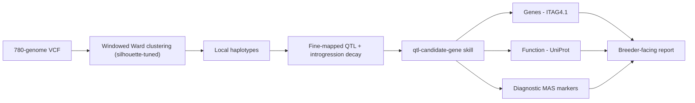

<p align="center">
  
</p>

# haploqtl

[](https://github.com/tayloranthonyanderson/haploqtl/actions/workflows/ci.yml)
[](LICENSE)
[](https://www.python.org/)

Local-ancestry inference that turns large whole-genome sequence libraries into fine-mapped QTL and predicted trait donors. Reproducible, typed, and tested.

`haploqtl` detects cryptic ancestral introgressions, narrows the genomic intervals of quantitative trait loci (QTL), traces those loci to their historical donor cultivars, and predicts the trait in untested gene-bank accessions — without the need for purpose-built mapping populations.

> *Personal project, built on my own time and equipment using publicly available or self-collected data. Not affiliated with, funded by, or derived from any employer's work, data, or systems.*

> **Provenance.** This project modernizes and extends the method published in
> Anderson *et al.* (2024), *The Plant Journal* — [doi:10.1111/tpj.16495](https://doi.org/10.1111/tpj.16495),
> on which I am first author. The original research scripts live at
> [masudermann/HaplotypeAnalysis_Visualization](https://github.com/masudermann/HaplotypeAnalysis_Visualization);
> the reference clustering script (which I authored) is vendored verbatim under [`legacy/`](legacy/)
> and is the baseline this repository is being rebuilt around.

## The method

Genomes are grouped into **local haplotypes** along a stepped, sliding genomic window using **Ward hierarchical agglomerative clustering**. The merge-distance threshold is not fixed: for each window it is **auto-tuned by maximizing the mean silhouette coefficient**, so the number of haplotype clusters emerges from the genetic variance present in that window. This needs no genetic map, no reference panel, and no pre-specified number of ancestral groups — and it scales to hundreds of genomes in hours. In the source paper it fine-mapped two early-blight resistance QTL (a 70% and 56% reduction in interval size), traced them to the cultivars *Devon Surprise* and *Hawaii 7998*, and predicted resistance that was then **experimentally confirmed** in gene-bank accessions.

## Pipeline



## Quickstart

Requires [uv](https://docs.astral.sh/uv/) (`curl -LsSf https://astral.sh/uv/install.sh | sh`).

```bash
git clone https://github.com/tayloranthonyanderson/haploqtl
cd haploqtl
uv sync --extra dev                 # creates .venv and installs everything
uv run bash scripts/run_demo.sh     # reproduce a minimal EB-9 result on the fixture
```

The demo runs windowed haplotype clustering over the bundled **780-genome chr09 fixture** (~4 Mb spanning the EB-9 QTL) and writes per-window haplotype-cluster tables to `output/`. Run the test suite with `uv run pytest`.

### CLI

```bash
uv run haploqtl cluster data/SL4.0ch09_subset.vcf.gz \
    --chrom ch09 --window 250000 --step 100000 \
    --d-min 2 --d-max 80 --d-step 10 \
    --output output/ch09_haplotypes.csv
```

The merge-distance threshold is auto-tuned per window (`--d-min/--d-max/--d-step` set the search grid). Output is a tidy long table — one row per (window, sample) with columns `chromosome, position, sample, cluster, distance_threshold, PC1..PCk`. See `uv run haploqtl cluster --help` for all options.

Then call the introgression interval, % reduction, and per-line donor-block retention straight from the VCF:

```bash
uv run haploqtl introgression data/SL4.0ch09_subset.vcf.gz --chrom ch09 \
    --resistant "Devon Surprise,Cambell 1943,NC EBR 2,NC 1 CELBR A,NC 1 CELBR B,CU151095-146,CU151011-146,CU191357,CU201041" \
    --susceptible "NC EBR 1,Brandywine,NC 84173" \
    --prior 61819509-63679761
```

This clusters, runs the two-way diagnostic contrast, narrows EB-9 to the longest gap-tolerant diagnostic run (550 kb, **70.4% reduction**), summarizes per-line donor-block retention and the fine-mapped core, and refines the boundary to SNP resolution. Accession names are resolved to VCF IDs automatically. See `uv run haploqtl introgression --help`.

Or **paint** each accession where it shares a donor's haplotype along the chromosome — the modern equivalent of the original R chromosome-painting figure (prints a terminal painting; `--svg` writes a to-scale figure):

```bash
uv run haploqtl paint data/SL4.0ch09_subset.vcf.gz --chrom ch09 \
    --benchmark "Devon Surprise" --highlight 62400075-62950075 --svg eb9_painting.svg
```

<p align="center">
  
</p>

## Results

On the bundled 780-genome chr09 panel, `haploqtl` reproduces the paper's EB-9 result end to end — clustering, introgression calling, and interval-narrowing all in code:

- **EB-9 fine-mapped to a 70.4% reduction** (to `SL4.0ch09:62.40–62.95 Mb`, 550 kb from the prior ~1.86 Mb interval), validated two ways: window-for-window against the original R contrast, and the clustering against the legacy script (identical partitions wherever the merge-distance agrees).
- **Traced to the 1920s heirloom *Devon Surprise*** — its donor haplotype is shared across the resistant pedigree and absent from susceptibles; 185 diagnostic MAS markers refine the boundary to `62.60–62.94 Mb`.

In the source paper (Anderson *et al.* 2024, not recomputed here), haplotype-predicted resistance was **confirmed *in planta*** (predicted-resistant vs -susceptible stem disease, mean 3.2 vs 28.2; Welch *t*(31.3) = −5.8, *P* < 0.001).

## Worked examples

Two runnable examples go further than the headline reproduction, entirely from the bundled data. Each script's docstring walks through the reasoning:

- [`examples/finemap_eb9.py`](examples/finemap_eb9.py) — sharpens EB-9 from a 70% to an **81% reduction** by adding a phenotyped-susceptible recombinant (*Ailsa Craig*), and shows why the resistant recombinants can't tighten the other edge.
- [`examples/finemap_eb5.py`](examples/finemap_eb5.py) — points the same clustering and two-way contrast at a **second locus** (a different donor, trait, and chromosome) and recovers the published EB-5 introgression (~56% reduction).

Run with `uv run python examples/finemap_eb9.py` (or `finemap_eb5.py`).

## Agent Skill: `qtl-candidate-gene`

An [Agent Skill](skills/qtl-candidate-gene/) (in Anthropic's `SKILL.md` format) that interprets a fine-mapped interval the way a geneticist would — turning coordinates into biology:

1. **Genes in the interval** — from a bundled SGN **ITAG4.1** slice (SL4.0), paper-exact `Solyc` IDs + functional descriptions.
2. **Protein function** — live **UniProt** REST query (the genes-to-function database step).
3. **Diagnostic MAS markers** — variants present in all resistant donors and absent from all susceptible controls, computed from the VCF (reproducing the paper's contrast).
4. **Synthesis** — a ranked, mechanistically-reasoned candidate-gene report + marker table.

On the EB-9 interval it recovers exactly the gene families the paper highlighted (potassium transporters, F-box, cation efflux, metal-tolerance, Fe(II)-oxygenase) and 185 diagnostic markers whose first position coincides with the paper's chromosome-painting boundary. See the [worked example](skills/qtl-candidate-gene/EXAMPLE.md).

## Repository layout

```
haploqtl/
├── src/haploqtl/      # io (VCF→dosage), windows, cluster (silhouette-tuned Ward),
│                      # contrast + introgression + markers (interval-narrowing &
│                      # donor-block retention), painting, accessions, cli
├── skills/            # qtl-candidate-gene Agent Skill (SKILL.md + scripts + references)
├── legacy/            # vendored, attributed reference script from the published paper
├── data/              # bundled chr09 + chr05 fixtures (780 genomes) + names + phenotypes
├── examples/          # finemap_eb9.py (sharpen EB-9) + finemap_eb5.py (generalize to EB-5)
├── scripts/           # run_demo.sh — reproduce a minimal EB-9 result
├── tests/             # unit, CLI, skill, legacy-baseline, R-equivalence (tests/r +
│                      # tests/fixtures golden) and clustering↔legacy tests
└── .github/workflows/ # CI: lint + format + type-check + test on Python 3.11 & 3.12
```

## Status & roadmap

This repository is under active development. Phases 0–2 are complete: a typed, tested `haploqtl` package with a real CLI, plus an Agent Skill that interprets a fine-mapped interval into candidate genes and MAS markers — all reproducible from a clean `git clone`.

- [x] **Phase 0 — Foundations & provenance.** Packaged project, pinned environment, CI, bundled chr09 fixture, reproducible demo, vendored reference implementation.
- [x] **Phase 1 — Modernized core.** Reference script refactored into a typed, tested, documented `haploqtl` package with a real CLI. Two latent bugs in the reference fixed: the silhouette search no longer aborts to a fixed fallback threshold on a single degenerate distance, and the final genomic window is no longer dropped.
- [x] **Phase 1.5 — Downstream introgression layer (R → Python).** The published downstream analysis lived entirely in R (`visualize_haplotypes.Rmd`). Ported into the typed, tested package: `contrast` (the one/two-way diagnostic contrast), `introgression` (algorithmic interval-narrowing — the original did it by eye — plus per-line donor-block retention and the fine-mapped core), and `markers` (diagnostic SNPs). Exposed as `haploqtl introgression`. Validated by **window-for-window equivalence to the original R** and a new **clustering ↔ legacy equivalence test** (identical partitions where the merge-distance agrees).
- [x] **Phase 2 — Agent Skill.** [`qtl-candidate-gene`](skills/qtl-candidate-gene/) — interval → candidate genes (ITAG4.1) → protein function (live UniProt) → diagnostic MAS markers → breeder report. Authored in Anthropic's Agent Skill (`SKILL.md`) format.
- [ ] **Next — Evaluation benchmark.** A small, verifiable benchmark scoring model *judgment* on the candidate-gene workflow — hallucinated genes/functions, mis-ranked candidates, misread genotypes, ungrounded citations (in design).

## Citation

If you use this software or method, please cite the paper:

```bibtex
@article{anderson2024haploqtl,
  title   = {Detection of trait donors and {QTL} boundaries for early blight resistance
             using local ancestry inference in a library of genomic sequences for tomato},
  author  = {Anderson, Taylor A. and Sudermann, Martha A. and DeJong, Darlene M. and
             Francis, David M. and Smart, Christine D. and Mutschler, Martha A.},
  journal = {The Plant Journal},
  volume  = {117},
  number  = {2},
  pages   = {404--415},
  year    = {2024},
  doi     = {10.1111/tpj.16495}
}
```

## License

[MIT](LICENSE) © 2026 Taylor A. Anderson. The bundled fixture derives from publicly
available sequence data (NCBI SRA BioProject PRJNA790656 and other public accessions; see
[`data/README.md`](data/README.md)).
